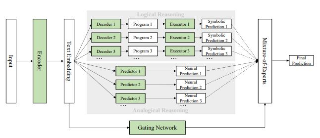

# A Neural-Symbolic Approach to Natural Language Understanding

## Framework



## Prepare

First download the entire code file or use git clone. 

Then download NSP_data.zip from [here](https://drive.google.com/file/d/1rtK0B5_-pv27EsuhELA6679IRmyRfE-M/view?usp=sharing).

Then unzip the data.zip in data to the src.

The final folder structure is as follows:

```
--DROP
----src
--------baseline.py
--------run.sh
--------...
--------data
----------drop_dataset_train.json
----------drop_dataset_dev.json
----------...
```

## data introduction
- drop_dataset_train,drop_dataset_dev,drop_dataset_test: The original file for the DROP dataset.
- questionId2program, questionId2program_dev: Annotation files for the DROP dataset. Note that we only annotated part of the dataset.
- questionId2type, dev_questionId2program_type: Files that record the question type.
- corenlp_result: Files that record the corenlp result of the passage and question.


## Usage

Attention: The code is running on the 4-GPUS equipment. And the final_batch_size=input batch_size* number_of_GPUS. So you should resize the batch_size and eval_batch_size to the suitable size.

Use the following code to train Analogical Reasoning Module.

```python
python3 baseline.py \
--do_train --do_eval --answering_abilities program --encoder_type=bart_encoder --num_decoder_layers=12 --max_epoch=100 --batch_size=8 --eval_batch_size=8 --warmup=-1 --name_of_this_trial=bart_training --num_eval_epoch=5 --lambda_list "1.0" --delete_no_number_answer --save_model --learning_rate=1e-5 --bert_learning_rate=1e-5
```


Use the following code to train Logical Reasoning Module.

```python
python3 baseline.py \
--do_train --do_eval --answering_abilities passagespan questionspan multispans count --encoder_type=split --num_decoder_layers=12 --max_epoch=20 --batch_size=4 --eval_batch_size=8 --warmup=-1 --name_of_this_trial=roberta_training --num_eval_step=500 --delete_null_program  --lambda_list "0.4" "0.4" "0.4" "0.4"   --save_model --no_add_number_token_text   --learning_rate 1e-4 --weight_decay 5e-5 --bert_learning_rate=1.5e-5 --bert_weight_decay=0.01 --gradient_accumulation_steps=1 --lambda_is_ok_for_spans=1.0 --use_original_loss
```


Use the following code to train Answer Classifier Module.

Attention to replace the **BEST_ROBERTA_CHECKPOINT** and **BEST_BART_CHECKPOINT** with your best checkpoint.

```python
python3 baseline.py \
--do_train --do_eval --answering_abilities passagespan questionspan multispans program count --encoder_type=split --num_decoder_layers=12 --max_epoch=10 --batch_size=4 --eval_batch_size=8 --warmup=-1 --name_of_this_trial=classifier_train --num_eval_step=100 --delete_null_program --lambda_list "1.0" "1.0" "1.0" "1.0" "1.0" --save_model --no_add_number_token_text --learning_rate 1e-3 --gradient_accumulation_steps=1 --lambda_is_ok_for_spans=0.0 --load_checkpoint --checkpoint_path=output/roberta_training/BEST_ROBERTA_CHECKPOINT.pt --checkpoint_path2=output/bart_training/BEST_BART_CHECKPOINT.pt --loss_type=only_classifier --classifier_method=2 --get_old_train_answers --as_label=em

```